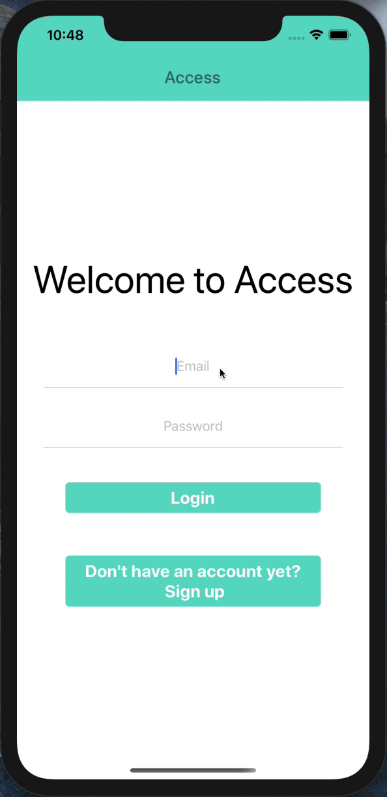
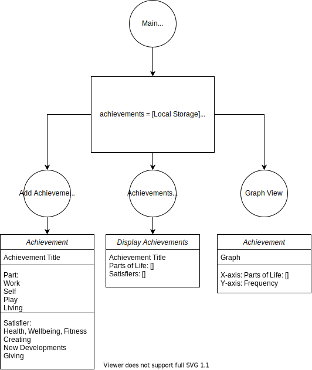

# Acknowledge



**What it is**: This app is a way for people to see & track everything they do

**What it’s about**: It is a way for people to see all of their achievements and acknowledge themselves for it

**What we want it to leave people with**: With feelings of success, satisfaction and self appreciation. With excitement for what will come next.

Acknowledge is an app to save your achievements over your day. A lot of achievements that we make day to day are usually lost in the noise of our busy lives; sometimes small, sometimes intangible but Acknowledge seeks to change that. With Acknowledge you can record your day to day achievements and place where they fit into your lives.

This coding project is being built by a team of coders from Makers Academy, lead by David Stewart at the direction of Julie McManus.

Find out more at [Acknowledge web page](https://acknowledgeyourpower.wordpress.com/)

## Try out the app now!!!

The app has been deployed to netlify using a web build version of the project. It can be accessed [here](https://access-your-achievements.netlify.app/).

## Getting Started

To run this project you will need to have the React Native Expo client installed and Node.js. You will also need to have either Xcode or AndroidSDK installed to run the mobile application in an emulator. Therefore it is recommended that you only run this application on your local computer if you already have these installed, else there will be a browser deployment available in the near future.

### Prerequisites

You will need React Native Expo installed to run this mobile app, instructions for installation can be found in the [Expo documentation](https://docs.expo.io/get-started/installation/).

You will also need to have Node.js installed to run this project with the [latest release found here](https://nodejs.org/en/).

If you are using a mac, it is recommended to install Xcode to gain access to the iOS emulator. Instructions for installing the emulator for React Native Expo can be found [here](https://docs.expo.io/workflow/ios-simulator/)

### Installing

Firstly clone (if you don't plan to make changes) or fork (if you do plan to make changes) this repo via github.

After downloading the repo, open it within your IDE of choice.

Then open the terminal within the parent folder and, if possible, use yarn to install the required node modules

```
yarn install
```
Otherwise use npm, those this is likely to cause issues if you install any new packages...

```
npm install
```
After installing the required node modules, run the expo client

```
expo start
```

Once you have run expo client, a new tab will be opened in your web browser with the expo console where you can choose to run the project in an emulator of your choice: iOS, Android or Web.

Enjoy!

### User Stories

Minimum Viable Product - Complete

```
As a user,
I want to write down my achievement,
So that I can save them.

As a user,
I want to retrieve my achievements,
So that I can view my past successes.

As a user,
I want my achievements to be saved locally,
So that they are saved after closing the app.

As a user,
I want to view my achievements in categories,
So that I can see which parts of my life I am currently filling up the most.
```

Additional User Stories
```
As a user,
I want to be able to login,
So that I can view my achievements from any device.

As a user,
I would like to open the app homepage,
So that I can be displayed with the most useful information.

As a user,
I want to receive notification reminders,
So that I am reminded to do a certain task or view certain things.

As a user,
I want to view my past achievements organised by day,
So that I can more easily navigate them.

As a user,
I want to view my past achievements on a calendar,
So that I can more easily navigate them.

As a user,
I want my achievements to be visualised beautifully,
So that I can pick out useful information from them.

As a user,
I want create a to do list for the day,
So that I connect these to my achievements.

As a user,
I want to be able to add challenges I faced,
So that I can save them.
```

### App Structure
<p align="center">

</p>

## Authors

* **David Stewart** - *Initial work* - [DavidStewartLDN](https://github.com/DavidStewartLDN)
* **Illias - the Greek - Grigoropoulos** - *Team Member* - [IliasMariosG](https://github.com/IliasMariosG)
* **Katie Jones** - *Team Member* - [katieljones](https://github.com/katieljones)
* **Matthew Lock** - *Team Member* - [mattybwoy](https://github.com/mattybwoy)
* **Tom Ratcliffe** - *Team Member* - [ratcliffetj](https://github.com/ratcliffetj)
* **India Rex** - *Team Member* - [indisaurusrex](https://github.com/indisaurusrex)
* **Joanne Chen** - *Team Member* - [Joanne0330](https://github.com/Joanne0330)

